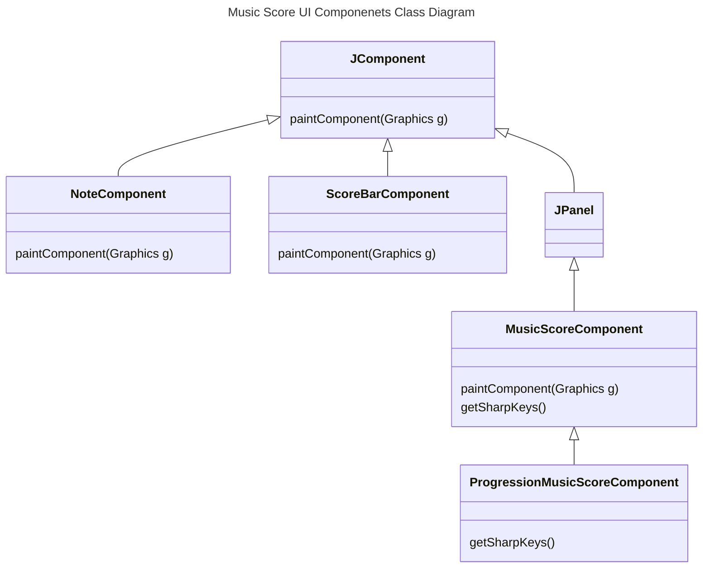
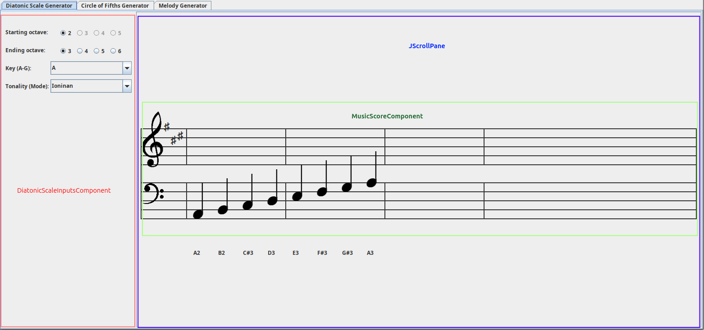
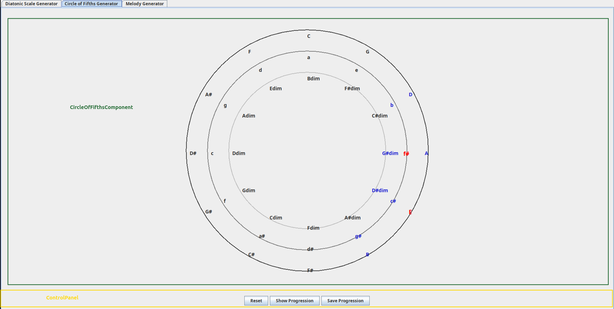
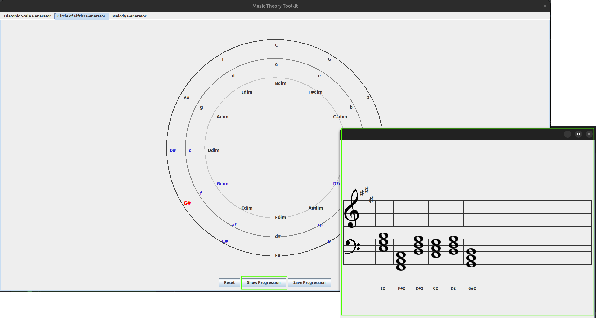
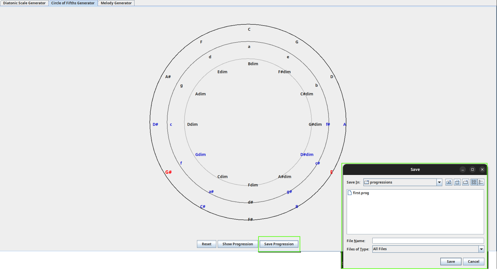
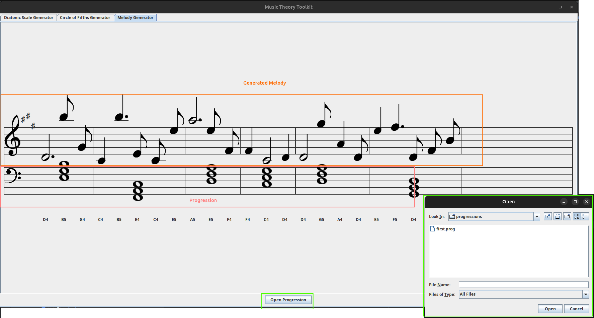

## About the application

 ```Main``` is the entry point of the application, It creates the main JFrame that includes a Tabbed Panel that includes:

- ``ui.diatonicscale.DiatonicScalePanel`` - Diatonic scale user interface 
- ``ui.circle.CircleOfFifthsPanel`` - Circle of Fifths user interface
-  ``ui.melodygenerator.MelodyGeneratorPanel`` - Melody generator user interface

The OOP principles used:

Encapsulation - most of the classes hides the implementation details to the outside world and defines methods that
are only required functionality.

Inheritance - I use inheritance in  building custom UI components. For example ``MusicScoreComponent`` extends a ``JPanel`` and it overrides
``paintComponent`` method in order to render the score content

Polymorphism - used when we override the behavior of custom ui components from the ``ui.componenets`` most of the re-usable custom
score overrides the ``paintComponent`` methods. This means that when adding the components to a UI container the rendering functionality
us delegated to the child component. Also, Polymorphism is used in the case of the delegating events from one component to another, for
example ``ProgressionChangeListener`` ``DiagnosticScaleListener``


Use of constructors - Classes that cave complex rules for creation use overloaded constructors in order to make sure that when a particulart
instance is create is created correctly for examscaleple ``scale.Note``





## Diatonic scale

When user selects the scale parameters from the control panel the sale is automatically updated

``ui.diatonicscale.DiatonicScalePanel`` - container panel that encapsulates the UI subcomponents ``DiatonicScaleInputsComponent`` - panel that display and implements the 
validation rules for the input parameters of the diatonic scale and ``ui.components.MusicScoreComponent`` it also implements the interface ``DiatonicScaleParameterListener``

which means it can receive ``DiatonicScaleInputs`` parameter instance when the user will change them in the ui, then ``DiatonicScalePanel``  will update t
``MusicScoreComponent`` with the new parameters




## Circle of fifths

``ui.circle.CircleOfFifthsPanel`` -container panel that encapsulates the UI subcomponents ``CircleOfFifthsComponent`` and 2 buttons in order to Reset to default
or save the current progression

Main Screen


Show progression



Save progression


## Melody generator



### TODO

1. Key signature order for sharps and flats the order is different
2. Octaves : add bass clef
3. Rules for chords in bass clef, don't go below F2, and don't go above B3
4. Scales need to move up and down from selected octaves
5. Sharps and flats need to be added for other modes


## Circle of fifths:

### TODO

1. Append clicked button to string. then when save progression is
   clicked append it to a new file the user chooses
2. Only highlighted buttons are the ones from the first note clicked
   and the most recent note clicked
3. Show progression and save progression button
4. Compare notes from each chord clicked to the notes of the scale.
5. If any modifications are needed to the note of the chord, add
   necessary symbol before it

## Melody generator

### TODO


1. Takes chord progression file
2. Takes number of chords to calculate how many bars are needed
   (number of chords in list = no of bars)
3. Randomize a rhythm for each bar.
4. concept of bars and beats introduced. each bar of a chord has 4 beats.
5. note lengths can vary between 4,3,2,1.5,1, and 0.5
6. bar beat count = 4.
7. randomly pick note length from the list. add that length to a
   melody rhythm list.
8. bar beat count = 4 - value for length of note
9. loop. needs comparisons such that:
    1. if beat count after subtraction = 0, end loop and proceed to next bar
    2. if beat count after subtraction > 0, loop again
    3. if beat count - the next randomly selected number < 0, do not
       add it to the melody rhythm list, and randomly pick another value
    4. in summary, beat count - rns >= 0, if not, reloop

10. then, for every note length value, randomly select a note from the
    scale of the chord of the bar.
11. then compare the note to that of the tonic scale (first chord)
12. if the note is NOT in the tonic scale, randomly select another one
    until it is

13. once we have all the notes for each bar, we want a final check, to
    make sure the note of the chord in each bar appears at least once
14. if there is no chord note in the bar, randomly select a note to
    replace with the chord note.

15. okay. now we have some bars, each which contain data on the length
    of each note in it, and the note played.
16. since the melody generator spans over 2 octaves, the octave each
    note has needs to randomly be picked.
17. this will help determine the height of the note needed

18. now we have all this, we can display it.
19. first draw bar line at the start. move one column over. then
    display the note with the symbol corresponding to the value of length
    of the note,
20. and do this at the height determined from, note height index, and
    the octave of the note
21. draw the next notes till the end of the bar.
22. loop until final bar is reached, and displayed.